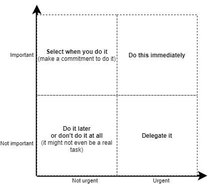
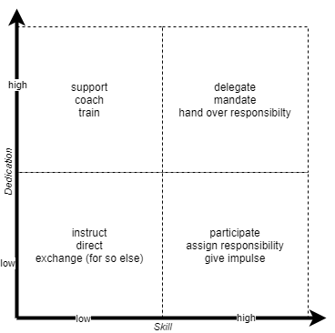

# Introduction
Leadership is a crucial element in successful organizations.
I believe that a successful leader has both, knowledge and tools (along with some other critical factors). In this list, I want to provide links to literature, resources and methods that can be useful when leading others. The focus will be on modern leadership styles as well as the area of modern work as common in software engineering.
I try  to curate this as a classic awesome list. However, at some points I will contribute more background and literature review so that you find what you are looking for quicker.

# Methods and tools

Having the proper tools at hand is a crucial part of leading people. By tools, I generally mean methods you can use in moderating, meetings, 1:1s and others that help you gain information, identify necessary actions, prioritize and track tasks. This is important especially in less hierarchical environments where you want your team to equally contribute to mutual success.

Just let me hint you to the most important method you have at your disposal (in my opinion): **Retrospectives** \
Retros, if done right, give you essential insights into what works and what doesn't in your team and help you to identify ways to improve. So I strongly recommend, you dive deep into how to do retros properly and effectively and what tools you can use. Nearly all of the tools I list here are valuable in retrospectives. I go into more depth about retros [here](content/retrospectives.md).

I am categorizing here according to "The decision book" (see below) as this is a neat categorization to me. However, some methods don't only fit in one category (e.g., you can use a SWOT analysis in multiple settings).

## Improving myself

Methods in this category are useful to identify goals and challenges, structure ideas and information in oneself's daily work.

### The Eisenhower matrix
The classic tool of prioritizing tasks. It helps you to find out what to do with a specific task at hand. For that, you assess its importance and its urgency. This results in a 2D plot that you can divide into quadrants.

The bottom left quadrant is tasks that are neither important nor urgent - those can either go straight into the trash (Don't do) or be delayed until they become either urgent or important. Tasks on the bottom right are urgent but not important - those can easily be delegated. The top left has tasks that are important but not urgent - make a commitment for those to do them at a certain point in future. Finally, the top right tasks are urgent and important -  make them your current prio one and do them immediately. 

### SWOT analysis
coming soon

### Goals: SMART, PURE, CLEAR
Goals are an essential leadership tool (and of course also a self-improvement tool). However, we tend to formulate goals too fuzzy to be effective. Here are three sets of assessment criteria for effective goals.

*SMART*
  - **S**pecific: If you agree on a goal, leave no room for interpretation
  - **M**easurable: Find meaningful ways to measure your success
  - **A**ttainable: If it can not be achieved, what good is this goal? Also often called "Agreed" at this point but we have that below at CLEAR
  - **R**ealistic: Even if it is attainable, it can still be an unrealistically high goal within an unrealistic timeframe
  - **T**ime-phased: Set clear timelines for a goal to be achieved, otherwise it will be postponed indefinetly

*PURE*
  - **P**ositively formulated: A positive formulation increases motivation to reach it. Use "I will reduce bugs by 50% instead of "My code will be less buggy"
  - **U**nderstood: Make sure the goal is clear to everyone involved.
  - **R**elevant: If your goal does not connect to what you want to achieve, it is not relevant. Often seen in politics.
  - **E**thical: Of course this is to a certain degree subjective, but make sure that a goal is based on shared values and does not conflict with someone's values. 

*CLEAR*
  - **C**hallenging: If it is too easy to reach, it is not a motivating goal (but also see realistic and attainable above)
  - **L**egal: Well....yes
  - **E**nvironmentally sound: Does it make sense in the context of our working environment? Am I actually able to achieve it in our work environment? Also consider the actual environment in your company goals...
  - **A**greed: All stakeholders of a goal must agree to it (not only the ones tasked with achieving it.)
  - **R**ecorded: Write it down so that in future, you have something to reference. Make sure that all stakeholders have access to a copy of it.

  For some more explanation look [here](http://www.theagileleader.co.uk/blog/goal-setting-are-your-goals-smart-pure-and-clear/)

## Understanding myself

### The Dunning-Krueger effect
This is not really a tool but it is worthwile knowing about. This effect describes a cognitive bias where people with lower ability in a certain field overestimate their performance or ability. In practice, you can see that whenever someone starts learning about a topic and very soon thinks he/she is already an expert and speaks very confidently about the topic and might already also convince you of their expertise.

In a leadership role, this can often happen to you in job interviews where you have to judge the skill level of someone. So be aware that in some cases you have to doubt a confident person a bit and ask deeper to uncover true expertise in a topic. Be aware that this person is not trying to trick you but it is a misconception of their own skills. This also does not mean that this person is a no-hire. You just need to be aware that some additional personal and skill development will be required.

Be aware that Dunning-Krueger also affects you (also in learning leadership). Honest self-reflection and getting feedback from others helps a lot here.

## Understanding others
Methods in here are used to gather insights to a team or group of people and their interworking. This includes finding friction or pain points, 

### The team canvas
coming soon

### Sailboat / Speedboat and friends
This one has many other names. Essentially, this data collection method is used to **identify aspects** of your (team) work, **that help or** others that **hinder** you or your team in their daily work.\
I use this as an essential part of retrospectives, it is easy to remember and moderate and yields very good results also in teams where you are just starting to establish a feedback culture. \
The metaphor used here is that we are a boat and our goal is to go as fast as possible. Thus we make use of winds that speed us up but we also have to deal with the anchors that slow us down. 

**How to**\
On a flipchart (or other shared space), draw a water surface (e.g., some blue waves) in the middle and a boat on it.\
Instruct your team to add two types of post-its (the more the better): anchor post-its below the water symbolize things that make you slower. Wind post-its above the water line symbolize things that make you faster.\

You can give the team 5-10 minutes to add items. After that, you should go through them and discuss them if necessary.\
After speedboat, you have a nice dataset that you can then (with other methods) prioritize to then deduct action items. 

As an extension, you can also have multiple levels of wind or anchor (strongest wind at the top, mid-wind near the water, small anchors right below the water line and heavy anchors at the bottom). This results in a first hint in the prioritization. 

**See also**\
[Coresponding retromat entry](https://retromat.org/en/?id=19)

### Belbin team roles
Each team has its own dynamics that also change with every new member in the team. Everyone of us naturally takes a specific role in the team in terms of behavior and functions. Meredith Belbin has invested several decades into researching the optimal combination of characters to form a perfect, high-performing team.\
Let's go into more detail [here](content/belbin.md)

### The team thermometer / barometer
This is a very simple technique to quickly get a feeling for the team mood.\
On a flipchart, draw a temperature scale from cold (everything is cool) to hot (I am mad) and ask each participant to mark their temperature level. From the accumulations of marks, you can quickly judge how it is going.

There is a similar technique with a barometer (from flying low to flying high) or with a weather report (draw a sun or clouds or rain or thunderstorm).

For in-person meetings, I prefer to use "Take a stand" where participants do not draw, but you use the whole room as scale and people have to stand up and go to the corresponding spot in the room. This works as a nice energizer e.g., to start a retrospective or to get people moving in a lame meeting.

*Variation: The role barometer*

**see also:**\
[Retromat entry for "Temperature gauge"](https://retromat.org/en/?id=22)\
[Retromat entry for "Take a stand"](https://retromat.org/en/?id=43)\
[Retromat entry for "Weather report"](https://retromat.org/en/?id=2)

## Improving others
This contains more action- and team-focused activities. However, there are also some general feedback techniques collected.

### De Bono Hats
coming soon

### Build your own *role* (team lead, product owner, boss, leader, ...)
coming soon

### Show more of, show less of, keep doing
coming soon

### Situation-dependent leadership
This is another quadrant plot. In this case, this tells you what type of lead you need to be for a certain colleague and a certain task. This is a handy tool since it does not align a leadership style according to the leader but according to the staff.\
You want to look at the dimensions of skill (of your colleague wrt. the task at hand) and her/his dedication (may be very enthusiastic or less so, also dependent on the individual drive of that person). It is important to not over-instruct well-skilled and motivated persons while some others need more support or encouragement.

If the skill as well as the dedication for the task are low (bottom left), you should give more detailed instructions and directions. You may also consider assigning the task to someone else.

If the skill is low but the dedication is high (top left), this colleague may be able to learn faster and will require you to support and coach.

If the skill is high but the dedication is low (bottom right), you need to show more participation in the task, make clear that the person is responsible and give impulses to incentivize.

In the lucky situation that you have a very skilled person who burns for the task, then fully delegate and give them responsibility and also reward for it.

## Tool resources
[retromat](https://retromat.org)

[funretrospectives](https://www.funretrospectives.com/)

[openpracticelibrary](https://openpracticelibrary.com/)

# Literature
In the following section, book cites are provided with links to detailed descriptions.\
For the books in German language, I try to provide corresponding English literature and also hint to English references and explain some conclusions in more detail. 

## Leadership softskills

## (German) Jenewein, Wolfgang. *Warum unsere Chefs plötzlich so nett zu uns sind*. Ecowin (2018).

### [Aschenbrenner, Peter *The Boss - Von Bruce Springsteen Führungsstärke lernen*. Wiley (2020).](books/aschenbrenner2020theboss.md)

### [Sinek, Simon *Leaders eat last: Why some teams pull together and others don't*. Penguin (2014).](books/sinek2014leaderseatlast.md)

## Books on leadership tools
The books listed here give you handy tools for your day-to-day leadership work. Mainly, those are tools for moderating (e.g., a retrospective or meeting) as well as decision facilitations for you and your team. I try to collect many of the tools also in the Methods and tools sections above individually. However, reading the books in addition is a good idea. 

### Krogerus & Tschäpeller
These books (essentially the one book but in two editions and languages), contain a concise collection of very valuable tools. They are shortly explained, just enough for you to get a feeling how it works and look for more info in specialized literature (i.e., googling how to apply it :) ). Thus, I recommend this as a handy field guide for almost every situation.

> (German) Krogerus, Mikael, and Roman Tschäppeler. *50 Erfolgsmodelle*. Kein & Aber (2015). \
(English) Krogerus, Mikael, and Roman Tschäppeler. *The Decision Book: Fifty models for strategic thinking (New Edition)*. Profile Books (2017). [Google Books Link](https://books.google.at/books?hl=de&lr=&id=yqE9DgAAQBAJ&oi=fnd&pg=PT5&dq=M+Krogerus,+R+Tsch%C3%A4ppeler&ots=E9gOaUwudN&sig=n25cAYDyUoFIIQxJ1Jv3YWGShJY&redir_esc=y#v=onepage&q&f=false)\
(German) Krogerus, Mikael, and Roman Tschäppeler. *Entscheiden*. Kein & Aber (2021).

### [Meyer, Erin. *The culture map: Breaking through the invisible boundaries of global business*. Public Affairs, 2014.](books/meyer2014culturemap.md)
The culture which we come from strongly influences how we act within a team. Especially if you are working with a cross-culture team, this book will give you very important tools to improve communication and generate value. 

### [Hohmann, Luke. *Innovation games: creating breakthrough products through collaborative play*. Pearson Education, 2006.](books/hohmann2006innovationgames.md)
This book will give you many valuable tools to improve your team and create value in group moderation, meetings and retrospectives.

### (German) [Steyrer, Johannes. *Die Macht der Manipulation - Wie man sich durchsetzt, wie man sich schützt*. Ecowin (2018).](books/steyrer2018manipulation.md)
**On the details page, I also list English literature from the book's references to give also non-German speakers an insight.** This book does not directly contain leadership tools. However, it shows some of the psychological tricks used in manipulation of people. If you are aware of those, you can prevent being manipulated and also protect your team from it. Still trying to find an adequate English book about then topic.

### Lipmanowicz, Henri, and Keith McCandless. *The surprising power of liberating structures: Simple rules to unleash a culture of innovation.* Seattle, WA: Liberating Structures Press, 2013.

## Some worthwile perspectives for (not only) leaders in (not only) technology
Putting a critical view on the own doing is a core ability for evolving in any kind of position. Especially in technology, we tend to be easily distracted by the next shiny thing and often fail to reflect on potential downsides. Here is some literature that helps us expand our view and look beyond tech fanciness.

### [Weizenbaum, Joseph. *Computer power and human reason: From judgment to calculation.* (1976).](books/weizenbaum1976computerpower.md)

Joseph Weizenbaum developed the Eliza chat system. In course of its evaluation, he made some shocking discoverings on how people thought, this software could be used. From those experiences, he grew to become a very famous technology critic pledging for more impact assessments of technology. 

# Media

Luke Hohmann on [innovation games](https://www.infoq.com/presentations/innovation-games/). See the associated book above. He talks about some of the games and a great story how this works even at the scale of a whole city.

## Klaus Leopold and business agility
[Ship building](https://www.youtube.com/watch?app=desktop&v=iIc9ttGurUo&feature=youtu.be) is a very nice activity for your team or other group of people to visualize and experience how flow of work in a system can change with the rules in the system. Klaus Leopold has moderated this session, it also gives enough background for you to try it out with your team. You will learn that work-in-progress limits and other simple rules greatly improve your value delivery. 

## Leadership by Simon Sinek 
### Leaders eat last
Simon Sinek's [video version](https://www.youtube.com/watch?v=ReRcHdeUG9Y) of the "Leaders eat last" book mentioned above. Very detailed and watchworthy. 

Here is a [video version](https://www.youtube.com/watch?v=_osKgFwKoDQ) of the "Infinity game", a follow-up work of his.

